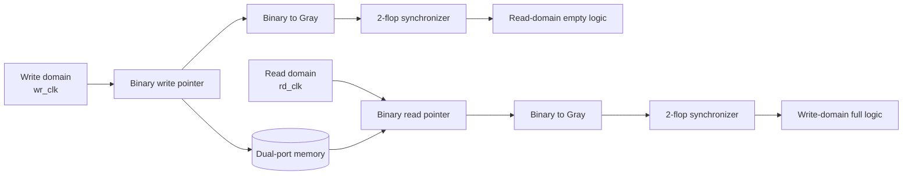
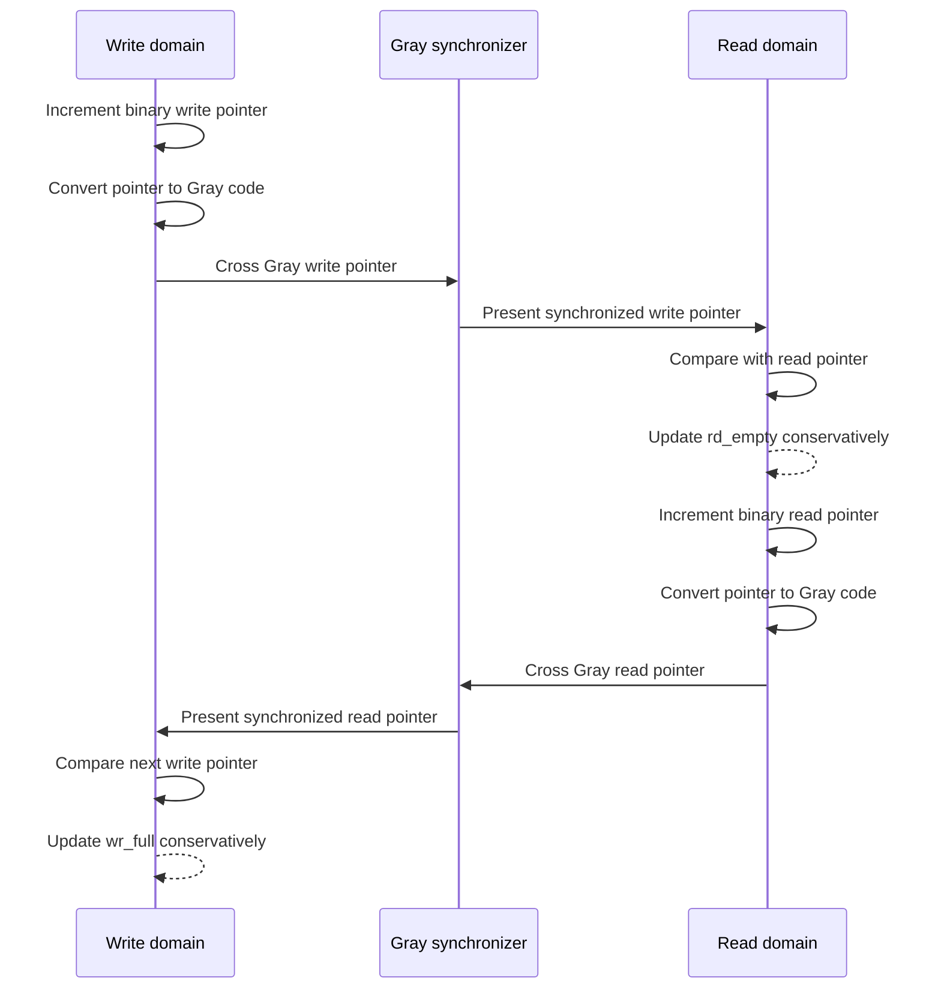

# Asynchronous FIFO with Gray-Code CDC

A parameterizable SystemVerilog asynchronous FIFO for safely transferring data between independent clock domains. The design follows the classic Cummings asynchronous FIFO architecture, commonly known as the Gray-code pointer or Style #2 implementation.

## Highlights

- Dual-clock FIFO architecture with separate write and read domains
- Gray-coded binary pointers for safe clock-domain crossing
- Two-flop synchronizers for transferred pointer values
- Full and empty detection using synchronized Gray pointers
- Parameterizable data width and FIFO depth
- Self-checking testbench with independent 100 MHz and 37 MHz clocks
- Reference queue for checking FIFO ordering and data integrity
- Tests for reset behavior, full/empty boundaries, CDC latency, and mixed traffic

## Architecture at a Glance


The write and read pointers remain in their own clock domains. Only Gray-coded pointer values cross the boundary through synchronizers; the memory data path remains separate.



## Pointer and Flag Flow



## Why Use an Asynchronous FIFO?

An asynchronous FIFO decouples a producer and consumer that run on unrelated clocks. The write side accepts data using `wr_clk`, while the read side removes data using `rd_clk`. Neither clock is required to have a fixed phase or frequency relationship with the other.

The FIFO provides:

- `wr_full` in the write-clock domain
- `rd_empty` in the read-clock domain
- Independent active-low resets for each clock domain
- Ordered data transfer through a dual-port storage array

The design does not transfer a multi-bit binary counter directly between clock domains. Doing so could allow the receiving clock to sample a mixture of old and new bits during a binary transition.

## Cummings Asynchronous FIFO Method

This implementation is based on the method described by Clifford E. Cummings for asynchronous FIFO design. The central idea is to keep binary pointers for local memory addressing, convert those pointers to Gray code, and synchronize only the Gray-coded pointers into the opposite clock domain.

### Local Binary Pointers

Each pointer is `ADDR_WIDTH + 1` bits wide:

- The lower `ADDR_WIDTH` bits select a memory location.
- The extra most-significant bit records buffer wrap-around.
- The write pointer is updated only on `wr_clk`.
- The read pointer is updated only on `rd_clk`.

For `ADDR_WIDTH = 4`, the FIFO has 16 entries and each pointer is 5 bits wide. The memory address uses bits `[3:0]`, while bit `[4]` distinguishes different buffer traversals.

### Binary-to-Gray Conversion

The local binary pointer is converted using:

```systemverilog
gray_pointer = binary_pointer ^ (binary_pointer >> 1);
```

Only the Gray-coded pointer crosses the clock-domain boundary. A valid binary or Gray pointer transition changes one Gray bit at a time, which limits the receiving domain to observing the old or new pointer value after synchronization instead of an arbitrary combination of binary bits.

### Two-Flop Synchronization

Each Gray pointer is passed through a two-flop synchronizer in the opposite clock domain:

```text
write Gray pointer --[2-flop synchronizer]--> read domain
read Gray pointer  --[2-flop synchronizer]--> write domain
```

The first synchronizer stage may become metastable. The second stage gives that value additional time to resolve before it is used by full or empty logic. This reduces metastability risk but introduces approximately two destination-clock cycles of status latency.

## Full and Empty Detection

The status flags are generated locally from the current pointer and the synchronized pointer from the other domain.

### Empty

The read side is empty when the next read pointer equals the synchronized write pointer in Gray code:

```systemverilog
rd_empty_next = (rd_gray_next == wr_gray_sync);
```

This means there is no unread data visible to the read clock domain.

### Full

The write side is full when the next write Gray pointer matches the synchronized read pointer in its address bits, but its two upper wrap bits are inverted:

```systemverilog
wr_full_next =
  (wr_gray_next[ADDR_WIDTH]     != rd_gray_sync[ADDR_WIDTH])   &&
  (wr_gray_next[ADDR_WIDTH-1]   != rd_gray_sync[ADDR_WIDTH-1]) &&
  (wr_gray_next[ADDR_WIDTH-2:0] == rd_gray_sync[ADDR_WIDTH-2:0]);
```

The inverted upper bits indicate that the writer is exactly one complete FIFO depth ahead of the reader. The lower bits matching means both pointers refer to the same memory address, but the extra wrap information distinguishes full from empty.

## Why Gray Code Is Necessary

Consider a binary transition from `0111` to `1000`: four bits change at once. If the destination clock samples during that transition, it could observe a value that never existed, such as `0000` or `1111`.

The equivalent Gray-code sequence changes only one bit per increment. The synchronizer can still add latency, but it avoids combining several independently changing binary bits into an invalid pointer.

## Storage and Read Behavior

`async_fifo_mem` models dual-port storage:

- Writes occur synchronously on `wr_clk`.
- Reads are combinational through the current read address.
- The write and read ports use independent addresses and clocks.

In a technology implementation, this structure may infer a dual-port block RAM or be replaced with a vendor-specific memory primitive. The exact read-during-write behavior should be checked against the target FPGA or ASIC memory macro when both sides access the same location near a boundary.

## Reset Considerations

Each clock domain resets its local pointer and synchronizer state. After reset:

- The write pointer is zero and `wr_full` is deasserted.
- The read pointer is zero and `rd_empty` is asserted.
- Synchronizer stages are cleared to zero.

In a real CDC system, reset assertion and release should be planned carefully. Both domains should start from a known empty state, and reset release should be synchronized to each local clock when required by the system-level reset architecture.

The synchronized pointers make full and empty flags intentionally conservative. For example, after a write, the read side may remain empty for a few `rd_clk` cycles while the write pointer crosses the synchronizer. This is expected CDC latency, not data loss.

## Structure

```text
async_fifo/
├── rtl/
│   └── async_fifo.sv
├── tb/
│   └── async_fifo_tb.sv
└── README.md
```

## Parameters

```systemverilog
parameter DATA_WIDTH = 8;
parameter ADDR_WIDTH = 4; // FIFO depth = 2**ADDR_WIDTH
```

The default configuration is an 8-bit-wide, 16-entry FIFO.

## Simulation

From WSL, run:

```bash
cd /mnt/c/Users/karti/OneDrive/Documents/demo

iverilog -g2012 -s async_fifo_tb -o async_fifo_sim \
  async_fifo/rtl/async_fifo.sv \
  async_fifo/tb/async_fifo_tb.sv

vvp ./async_fifo_sim
```

The testbench prints the test progress and a final pass/fail summary. To generate a waveform, add or retain `$dumpfile` and `$dumpvars` in the testbench, then open the generated VCD with GTKWave:

```bash
gtkwave async_fifo_tb.vcd
```

### Current Simulation Status

The RTL and testbench compile with Icarus Verilog, but the current regression reports read-data mismatches. The memory model uses a combinational read, while the testbench samples `rd_data` after the read pointer has already advanced. That timing can make the first observed value look like the following FIFO entry. The read task and read-data contract should be aligned before treating the regression as passing.

## Waveform Signals to Inspect

When viewing the generated VCD in GTKWave, start with these signals:

| Signal                    | Domain | What to observe                                   |
| ------------------------- | ------ | ------------------------------------------------- |
| `wr_clk`                | Write  | Source clock for writes and write pointer updates |
| `rd_clk`                | Read   | Source clock for reads and read pointer updates   |
| `wr_gray_ptr`           | Write  | Local Gray-coded write pointer                    |
| `rd_gray_ptr`           | Read   | Local Gray-coded read pointer                     |
| `wr_gray_sync`          | Read   | Synchronized write pointer                        |
| `rd_gray_sync`          | Write  | Synchronized read pointer                         |
| `wr_full`               | Write  | Write-side backpressure flag                      |
| `rd_empty`              | Read   | Read-side no-data flag                            |
| `wr_addr` / `rd_addr` | Local  | Memory addresses selected by each side            |
| `wr_en` / `rd_en`     | Local  | Accepted operation requests                       |

The synchronized pointers should change later than their source-domain pointers. That delay is expected and is the visual signature of the two-flop CDC path.

## Verification Strategy

The self-checking testbench uses independent clocks at approximately 100 MHz and 37 MHz so their edges continuously move relative to each other. A SystemVerilog queue acts as a reference model and checks that:

- Data is returned in FIFO order.
- Writes are blocked when `wr_full` is asserted.
- Reads are blocked when `rd_empty` is asserted.
- The FIFO reaches full and returns to empty correctly.
- The read-side empty flag observes CDC propagation latency.
- Mixed write/read traffic preserves data integrity.

The testbench is functional simulation. It does not model analog metastability, so CDC signoff should additionally include structural CDC analysis, timing constraints, and formal verification where required.

## Limitations and Assumptions

- `FIFO_DEPTH` is `2**ADDR_WIDTH`.
- The FIFO uses Gray-pointer synchronization rather than transferring binary pointers.
- Full and empty flags are conservative because of synchronizer latency.
- The provided memory model is intended for RTL simulation and synthesis inference; production implementations should confirm RAM inference and read-during-write semantics.
- The reset strategy assumes the system brings both domains to a compatible empty state.
- The current testbench exposes a read-data sampling timing issue that remains to be corrected.

This project is intended for RTL design practice, CDC study, and portfolio demonstration.
